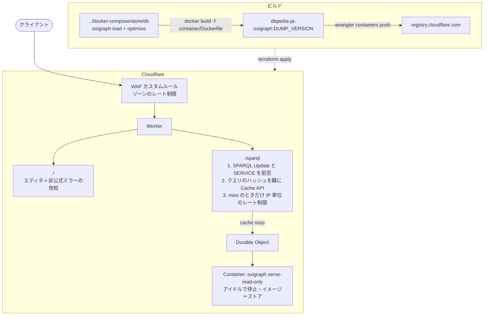

# DBpedia Japanese SPARQL Endpoint on Cloudflare

*English version: [README.md](README.md)*

## 構成

[`docker-compose/`](../docker-compose/README.ja.md) が作ったストアをコンテナイメージに焼き込み、Cloudflare Containers で動かす。その前段に Worker を置き、公開されるのは Worker だけにする。



## 前提

- **Workers Paid** プランの Cloudflare アカウント
- 公開ホスト名のドメインが同じアカウントのゾーンとして登録され、ネームサーバが Cloudflare を向いていること
- [mise](https://mise.jdx.dev/) / Docker / `curl` / `jq`
- `../docker-compose/store/db` にロード済みのストアがあること
  - `cd ../docker-compose && docker compose up --build`

## クイックスタート

```bash
cd cloudflare
mise trust
cf auth login
scripts/create-api-token.sh <account id> <zone id> # .env に書き込む
cp terraform/terraform.tfvars.example terraform/terraform.tfvars
$EDITOR terraform/terraform.tfvars

mise run lint
mise run test
mise run init
mise run plan

mise run deploy

time rqw -e https://ja-dbpedia.egpl.dev/sparql -Q 'SELECT ?o WHERE {
  <http://ja.dbpedia.org/resource/日本> <http://www.w3.org/2000/01/rdf-schema#label> ?o
} LIMIT 10'
```

## 運用

### データセットの更新

```bash
cd ../docker-compose
$EDITOR .env # DUMP_VERSION=<新しい版>
docker compose up -d download && docker compose up load

cd ../cloudflare
mise run deploy # イメージのタグは DUMP_VERSION
```

### コスト

| | 常時稼働 | `sleep_after = 20m` で 1 日の 2 割稼働 |
| --- | ---: | ---: |
| メモリ（9 GiB、$0.081/h） | $58.32 | $11.66 |
| ディスク（18 GB、$0.0045/h） | $3.63 | $0.73 |
| CPU（1 vCPU、アクティブ時 $0.072/h、使用率 10% と仮定） | $5.18 | $1.04 |
| Workers Paid | $5.00 | $5.00 |
| **合計** | **約 $72/月** | **約 $18/月** |

### 撤去

```bash
mise run destroy
wrangler containers images delete
```

## トラブルシューティング

**`No Durable Object namespace for class 'OxigraphContainer'`**
Worker バージョンのデプロイ前にコンテナアプリケーションが動いた。もう一度 `terraform apply` すればよい。通常は `depends_on` で順序が付くが、途中まで apply された状態からだとこうなることがある。

**しばらく放置したあとの最初のクエリが数秒かかる**
コールドスタート。`container_sleep_after` を伸ばすか、cron トリガーで軽いクエリを投げて温め続ける。

**どのクエリも空の結果しか返らない**
名前付きグラフにロードしたのにサーバが `--union-default-graph` なしで動いている（またはその逆）。`container/Dockerfile` と `../docker-compose/.env` の `GRAPH_URI` は揃っている必要がある。

**コンテナ起動時に `disk size exceeds instance limit`**
イメージが `container_disk_mb` より大きい。`mise run image` が展開後のサイズを表示する（push されるサイズはレイヤが圧縮されるぶん小さい）ので、上限 20000 と突き合わせ、`container_memory_mib` はその半分以上にする。

**普通に使っているのに 429 が返る**
`LIMIT` の無いクエリや `COUNT`・`REGEX` を含むクエリは `rate_limit_heavy`（既定で毎分 10）から引かれる。`LIMIT` を付けるか、この変数を上げる。

## ライセンス

DBpedia のデータは [CC BY-SA 3.0](https://creativecommons.org/licenses/by-sa/3.0/) と [GNU FDL](https://www.gnu.org/licenses/fdl-1.3.html) で提供されている。
