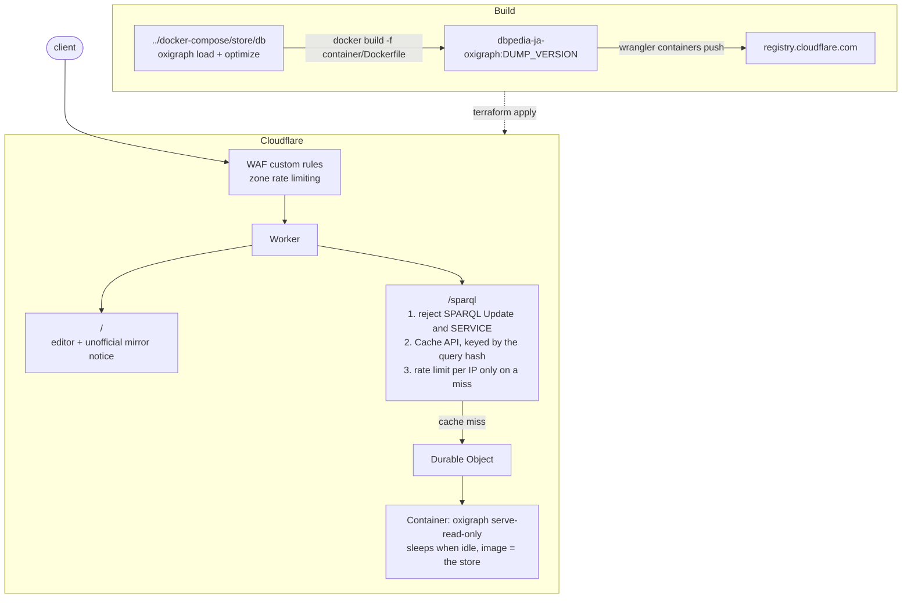

# DBpedia Japanese SPARQL Endpoint on Cloudflare

*日本語版: [README.ja.md](README.ja.md)*

## Overview





## Requirements

- A Cloudflare account on the **Workers Paid** plan
- The endpoint's domain registered as a zone in that same account, with its nameservers pointing at Cloudflare
- [mise](https://mise.jdx.dev/) / Docker / `curl` / `jq`
- A loaded store under `../docker-compose/store/db`
  - `cd ../docker-compose && docker compose up --build`

| Scope | Permission |
| --- | --- |
| Account | Workers Scripts Write, Workers Containers Write |
| Zone | Zone Read, Zone Settings Write, Sanitize Write (URL normalization), Firewall Services Write, Zone WAF Write, DNS Write, Workers Routes Write |

## Quickstart

```bash
cd cloudflare
mise trust
cf auth login
scripts/create-api-token.sh <account id> <zone id> # writes .env
cp terraform/terraform.tfvars.example terraform/terraform.tfvars
$EDITOR terraform/terraform.tfvars

mise run lint
mise run test
mise run init
mise run plan

mise run deploy

# check
time rqw -e https://ja-dbpedia.egpl.dev/sparql -Q 'SELECT ?o WHERE {
  <http://ja.dbpedia.org/resource/日本> <http://www.w3.org/2000/01/rdf-schema#label> ?o
} LIMIT 10'
```

## Operations

### Updating the dataset

```bash
cd ../docker-compose
$EDITOR .env # DUMP_VERSION=<new version>
docker compose up -d download && docker compose up load

cd ../cloudflare
mise run deploy # the image is tagged with DUMP_VERSION
```

### Cost

| | Always on | `sleep_after = 20m`, 20%/d |
| --- | ---: | ---: |
| Memory (9 GiB, $0.081/h) | $58.32 | $11.66 |
| Disk (18 GB, $0.0045/h) | $3.63 | $0.73 |
| CPU (1 vCPU, $0.072/h active, assuming 10% active) | $5.18 | $1.04 |
| Workers Paid | $5.00 | $5.00 |
| **Total** | **~$72/mo** | **~$18/mo** |

### Teardown

```bash
mise run destroy
wrangler containers images delete
```

## Troubleshooting

### `No Durable Object namespace for class 'OxigraphContainer'`

The container application ran before the Worker version was deployed. Run `terraform apply` again. `depends_on` normally orders the two, but a half-applied state can end up here.

### The first query after a quiet period takes several seconds

Cold start. Raise `container_sleep_after`, or keep an instance warm with a cron trigger that sends a cheap query.

### Every query returns an empty result

The data was loaded into a named graph but the server is running without `--union-default-graph`, or the other way round. `container/Dockerfile` and `GRAPH_URI` in `../docker-compose/.env` have to agree.

### `disk size exceeds instance limit` when the container starts

The image is larger than `container_disk_mb`. `mise run image` prints the unpacked size (the pushed size is smaller because layers are compressed); check it against the 20000 ceiling and keep `container_memory_mib` at least half of it.

### 429 during ordinary use

Queries without a `LIMIT`, and queries containing `COUNT` or `REGEX`, are drawn from `rate_limit_heavy` (10 per minute by default). Add a `LIMIT`, or raise that variable.

## License

DBpedia data is provided under [CC BY-SA 3.0](https://creativecommons.org/licenses/by-sa/3.0/) and the [GNU FDL](https://www.gnu.org/licenses/fdl-1.3.html).
