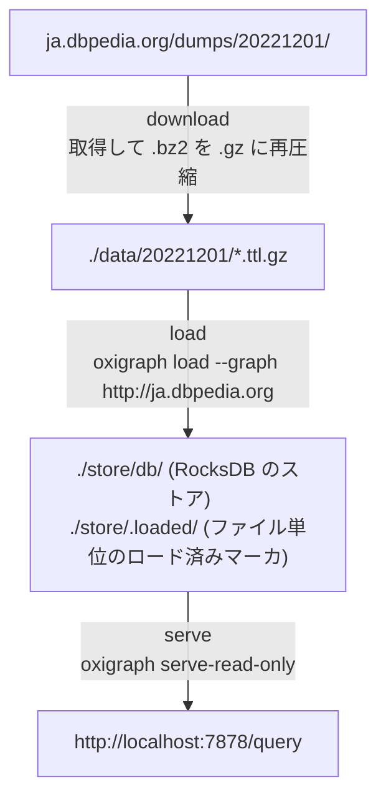

# DBpedia Japanese SPARQL Endpoint on Docker Compose

*English version: [README.md](README.md)*

## 構成



3 つのサービスは前段の正常終了を待って順に動く（`download` → `load` → `serve`）。常駐するのは `serve` だけ。

## Virtuoso 構成からの変更点

- 全文検索インデックス (`bif:contains`) と地理インデックスは無い。

## 前提

- Docker Engine と Docker Compose v2
- ディスク: `core` プロファイルでダンプ約 1.2 GB（gzip は元の bzip2 より 4 割ほど大きい）＋ストア。`ja` / `full` はさらに数倍必要
- メモリ: 特別な調整は不要。ロードで足りなくなったら `LOAD_BATCH_SIZE` を下げる

## クイックスタート

```bash
cd docker-compose
cp .env.example .env

# ポートやディレクトリを設定する
$EDITOR .env

docker compose up -d --build
```

進捗は次で確認する。

```bash
docker compose logs -f download
docker compose logs -f load
```

`load` が `[INFO] Done. The SPARQL endpoint is ready.` を出して終了すると、`serve` が自動的に立ち上がる。

- SPARQL エンドポイント: <http://localhost:7878/query>
- ブラウザ用のクエリ UI: <http://localhost:7878/>

### 動作確認

```bash
rqw -e http://localhost:7878/query -Q 'SELECT (COUNT(*) AS ?c) FROM <http://ja.dbpedia.org> WHERE { ?s ?p ?o }'
rqw -e http://localhost:7878/query -Q 'SELECT ?abstract WHERE {
      <http://ja.dbpedia.org/resource/日本> <http://dbpedia.org/ontology/abstract> ?abstract }'
```

## ディレクトリ

```text
docker-compose/
├── compose.yaml
├── .env.example            # 設定テンプレート。cp して .env を作る
├── downloader/
│   ├── Dockerfile
│   └── download.sh         # ダンプ一覧の取得・フィルタ・並列ダウンロード
├── loader/
│   ├── Dockerfile          # oxigraph バイナリをシェルのあるベースに載せる
│   └── load.sh             # oxigraph load と optimize
├── data/                   # ダンプの保存先 (git 管理外)
└── store/                  # RocksDB のストアとロード済みマーカ (git 管理外)
```

## データセットの選択

利用可能なバージョンは <https://ja.dbpedia.org/dumps/> で確認できる。`DUMP_VERSION` を変えるとダンプは `./data/<version>/` に、マーカは `./store/.loaded/<version>/` に分けて保存される。

`DUMP_PROFILE` で取得するファイル群を選ぶ。

| プロファイル | 内容 | ファイル数 | 圧縮後サイズ |
| --- | --- | ---: | ---: |
| `core` (既定) | `_lang=ja` のうち NIF / raw-tables / wikilinks / article-templates を除いたもの + `ontology-subclassof.ttl.bz2` | 31 | 約 0.84 GB |
| `ja` | `_lang=ja` の全ファイル | 38 | 約 5.9 GB |
| `full` | ダンプディレクトリの全ファイル (多言語共通ファイルを含む) | 114 | 約 29 GB |

個別に足したいファイルがあれば `DUMP_EXTRA_FILES` に空白区切りで書く。

```env
DUMP_EXTRA_FILES=ontology-subclassof.ttl.bz2 mappingbased-objects-uncleaned.ttl.bz2
```

プロファイルでは表現できない絞り込みは `DUMP_INCLUDE_REGEX` / `DUMP_EXCLUDE_REGEX` で行う。設定するとプロファイル既定のパターンを上書きする。

```env
DUMP_INCLUDE_REGEX=^(labels|short-abstracts|instance-types.*|categories)_lang=ja
DUMP_EXCLUDE_REGEX=^$
```

## `.env`

### Oxigraph

| 変数 | 既定値 | 説明 |
| --- | --- | --- |
| `OXIGRAPH_HTTP_PORT` | `7878` | エンドポイントと Web UI の公開ポート |
| `STORE_DIR` | `./store` | `db/`（RocksDB のストア）と `.loaded/`（マーカ）を置く |
| `OXIGRAPH_SERVE_CMD` | `serve-read-only` | `serve-read-only`、または読み書き可能な `serve` |
| `OXIGRAPH_SERVE_OPTS` | `--union-default-graph --cors` | サブコマンドに渡す追加フラグ |

`serve-read-only` は SPARQL UPDATE を `403` で拒否する。`/update` や `/store` HTTP API を使いたければ `serve` にするが、そのポートに届く相手は誰でもデータを消せることになる。

`OXIGRAPH_SERVE_OPTS` に足せる主なフラグ:

| フラグ | 効果 |
| --- | --- |
| `--union-default-graph` | `GRAPH` / `FROM` を書かないクエリからも名前付きグラフが見える |
| `--cors` | クロスオリジン要求を許可する |
| `--timeout-s <SECONDS>` | クエリ単位のタイムアウト |

### ダウンロード

| 変数 | 既定値 | 説明 |
| --- | --- | --- |
| `DUMP_BASE_URL` | `https://ja.dbpedia.org/dumps` | ダンプ配布ルート |
| `DUMP_VERSION` | `20221201` | ダンプのバージョン（ディレクトリ名） |
| `DATA_DIR` | `./data` | 保存先。実体は `${DATA_DIR}/${DUMP_VERSION}/` |
| `DUMP_PROFILE` | `core` | `core` / `ja` / `full` |
| `DUMP_INCLUDE_REGEX` | (空) | 指定するとプロファイルの include パターンを上書き |
| `DUMP_EXCLUDE_REGEX` | (空) | 指定するとプロファイルの exclude パターンを上書き |
| `DUMP_EXTRA_FILES` | `ontology-subclassof.ttl.bz2` | 無条件に追加するファイル名（空白区切り） |
| `DOWNLOAD_PARALLEL` | `4` | 同時ダウンロード数 |
| `RECOMPRESS_BZ2_TO_GZ` | `true` | `.bz2` を `.gz` に再圧縮する。**true のままにすること** — oxigraph は bzip2 を読めない |

ダウンロードは一覧に載っているバイトサイズと突き合わせ、一致するファイルは飛ばす。途中で止めても `docker compose up` し直せば `-C -` で再開する。

### ロード

| 変数 | 既定値 | 説明 |
| --- | --- | --- |
| `GRAPH_URI` | `http://ja.dbpedia.org` | 全トリプルを格納する名前付きグラフ |
| `LOAD_LENIENT` | `true` | `--lenient` を付ける。DBpedia のダンプには不正な IRI や言語タグが含まれる |
| `LOAD_NON_ATOMIC` | `true` | `--non-atomic` を付け、最後にまとめてではなくロード中に書き込む。ディスクを大幅に節約し、その分 CPU を使う |
| `LOAD_BATCH_SIZE` | `4` | 1 回の `oxigraph load` に渡すファイル数。並列に読まれるので、メモリが足りなければ下げる |
| `RUN_OPTIMIZE` | `true` | ロード後に `oxigraph optimize` を走らせる。時間はかかるが読み取り専用のミラーでは元が取れる |

loader は `${STORE_DIR}/.loaded/${DUMP_VERSION}/` にファイル単位でマーカを残すので、新しいものだけを読む。RDF は集合なので同じトリプルを二度入れても壊れはしないが、時間の無駄になる。

## 外付けディスクにデータを置く

`DATA_DIR` と `STORE_DIR` に絶対パスを書けばよい。compose 側の変更は要らない。

まずマウントする。デバイス名は挿し直しで変わるので、恒久化するときは UUID を使う。

```bash
lsblk -f /dev/hdd-example-1          # FSTYPE と UUID を確認
sudo mkdir -p /mnt/dbpedia
sudo mount /dev/hdd-example-1 /mnt/dbpedia
sudo mkdir -p /mnt/dbpedia/{data,store}
sudo chown "$(id -u):$(id -g)" /mnt/dbpedia/{data,store}
```

```text
# /etc/fstab
UUID=xxxxxxxx-xxxx-xxxx-xxxx-xxxxxxxxxxxx  /mnt/dbpedia  ext4  defaults,nofail,x-systemd.device-timeout=30  0  2
```

`.env`:

```env
DATA_DIR=/mnt/dbpedia/data
STORE_DIR=/mnt/dbpedia/store
```

SSD と HDD を併用できるなら分けるとよい。ダンプ (`DATA_DIR`) は最初に一度シーケンシャルに読むだけだが、ストア (`STORE_DIR`) は運用中ずっとランダム I/O を受ける。

```env
DATA_DIR=/mnt/dbpedia/data    # 外付け HDD
STORE_DIR=./store             # 内蔵 SSD
```

### ファイルシステムと権限

- **ext4 か xfs を使うこと。** RocksDB は POSIX のファイルロックと所有権を必要とし、exFAT・NTFS・FAT では成立しない。
- rootful Docker ではコンテナが root で動くため、作られたファイルは root 所有になり、ホストからは `sudo` 無しに消せない。rootless Docker なら自分の所有になる。[停止・破棄](#停止破棄)を参照。

### 性能

USB 接続の HDD にストアを置くとクエリは目に見えて遅くなる。RocksDB の読み取りがランダムだからである。`RUN_OPTIMIZE=true` のままにしておくとストアが圧縮され、遅いディスクほど効く。ダンプだけを HDD に置いてストアを SSD に残すなら、この点は問題にならない。

## 運用

### ダンプを追加・更新する

`.env` の `DUMP_PROFILE` や `DUMP_EXTRA_FILES` を変えてから、もう一度パイプラインを回す。

`DUMP_VERSION` を上げる場合、古いバージョンのトリプルは削除されない。同じグラフに新旧が混ざるため、追加ではなく入れ替えたいならストアを消す。

```bash
docker compose stop serve
docker compose up download
docker compose up load
docker compose start serve
```

### ロードをやり直す

マーカを消せば全ファイルを読み直し、ストアごと消せばゼロから作り直せる。

```bash
docker compose down
rm -rf store/.loaded          # 既存のストアに全部読み直す
rm -rf store                  # あるいは空のストアから作り直す
docker compose up -d
```

### 停止・破棄

```bash
# rootless
docker compose down                 # 停止 (データは残る)
docker compose down --rmi local     # 停止してビルドしたイメージも削除

# rootful
docker compose down
docker run --rm -v "$PWD/store:/x" alpine sh -c 'rm -rf /x/* /x/.[!.]*'
```

## トラブルシューティング

**`Error: IO error: While lock file: /store/db/LOCK: Resource temporarily unavailable`**
読み書きモードの `serve` がストアを掴んだまま loader が開こうとしている。`docker compose stop serve` してからロードし、その後起動する。

**ロードしてもトリプル数が増えない**
起動中のサーバが、開いた時点のスナップショットから答えている。`docker compose restart serve` する。

**`[WARN] Skipping N .bz2 file(s): oxigraph cannot read bzip2.`**
ダウンロード時に `RECOMPRESS_BZ2_TO_GZ` が `false` だった。`true` にして `docker compose up download` をやり直す。変換済みのファイルは飛ばされる。

**`Not able to guess the file format from file name extension 'bz2'`**
同じ原因を oxigraph 側から見たもの。`.bz2` のファイルが `oxigraph load` に直接渡っている。

**`[ERROR] No loadable file found under /data/<version>`**
ダウンロードが `.ttl` / `.nt`（必要に応じて `.gz`）を 1 つも作れていない。`download` のログと、`DUMP_VERSION` が実際に取得したディレクトリと一致しているかを確認する。

**`FROM` を書かないクエリが何も返さない**
全トリプルは名前付きグラフ `GRAPH_URI` に入っており、デフォルトグラフは空。`OXIGRAPH_SERVE_OPTS` に `--union-default-graph` を残すか、`FROM <http://ja.dbpedia.org>` を書く。

**SPARQL UPDATE が `403` を返す**
`serve-read-only` では想定どおりの動作。本当に書き込ませたいなら `OXIGRAPH_SERVE_CMD=serve` にする。

**loader がメモリ不足になる**
`LOAD_BATCH_SIZE` を下げる。1 バッチのファイルは並列に読まれるので、ファイル数を減らせばピークが下がる。

## ライセンス

DBpedia のデータは [CC BY-SA 3.0](https://creativecommons.org/licenses/by-sa/3.0/) および [GNU FDL](https://www.gnu.org/licenses/fdl-1.3.html) で提供されている。Oxigraph は [Apache-2.0 / MIT](https://github.com/oxigraph/oxigraph)。
