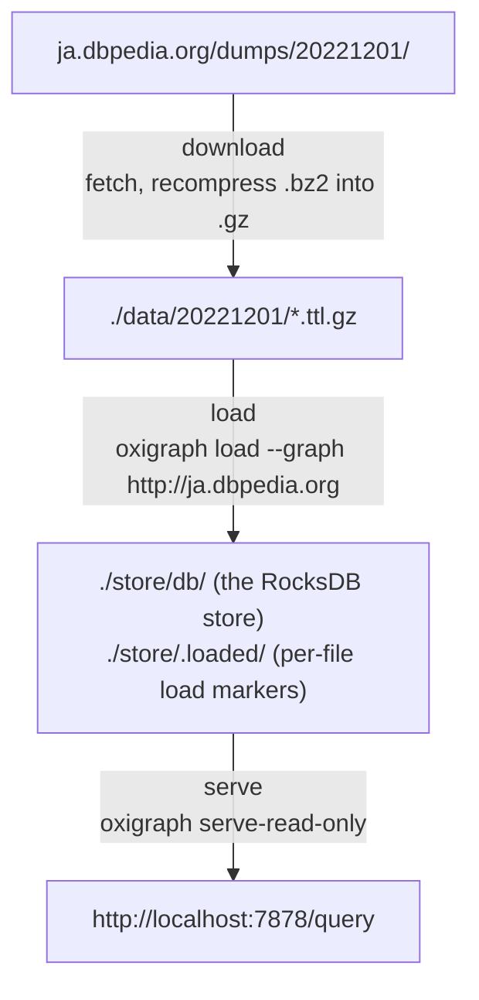

# DBpedia Japanese SPARQL Endpoint on Docker Compose

*日本語版: [README.ja.md](README.ja.md)*

## Overview



The three services run in order, each waiting for the previous one to exit cleanly (`download` → `load` → `serve`). Only `serve` stays up.

## Coming from the Virtuoso setup

- No free-text index (`bif:contains`) and no geo index.

## Requirements

- Docker Engine and Docker Compose v2
- Disk: with the `core` profile, about 1.2 GB of dumps (gzip is roughly 40% larger than the original bzip2) plus the store. `ja` and `full` need several times that
- Memory: nothing to tune. Lower `LOAD_BATCH_SIZE` if the load runs out

## Quickstart

```bash
cd docker-compose
cp .env.example .env

# set the ports and directories you want
$EDITOR .env

docker compose up -d --build
```

Follow the progress with:

```bash
docker compose logs -f download
docker compose logs -f load
```

Once `load` prints `[INFO] Done. The SPARQL endpoint is ready.` and exits, `serve` comes up on its own.

- SPARQL endpoint: <http://localhost:7878/query>
- Query UI for the browser: <http://localhost:7878/>

### Checking that it works

```bash
rqw -e http://localhost:7878/query -Q 'SELECT (COUNT(*) AS ?c) FROM <http://ja.dbpedia.org> WHERE { ?s ?p ?o }'
rqw -e http://localhost:7878/query -Q 'SELECT ?abstract WHERE {
      <http://ja.dbpedia.org/resource/日本> <http://dbpedia.org/ontology/abstract> ?abstract }'
```

## Choosing a dataset

The available versions are listed at <https://ja.dbpedia.org/dumps/>. Changing `DUMP_VERSION` keeps the dumps under `./data/<version>/` and the markers under `./store/.loaded/<version>/`, separately per version.

`DUMP_PROFILE` selects which set of files to fetch.

| Profile | Contents | Files | Compressed size |
| --- | --- | ---: | ---: |
| `core` (default) | `_lang=ja` without NIF / raw-tables / wikilinks / article-templates, plus `ontology-subclassof.ttl.bz2` | 31 | ~0.84 GB |
| `ja` | every `_lang=ja` file | 38 | ~5.9 GB |
| `full` | every file in the dump directory, including the multilingual ones | 114 | ~29 GB |

To add individual files, list them in `DUMP_EXTRA_FILES` separated by whitespace.

```env
DUMP_EXTRA_FILES=ontology-subclassof.ttl.bz2 mappingbased-objects-uncleaned.ttl.bz2
```

For selections the profiles cannot express, use `DUMP_INCLUDE_REGEX` / `DUMP_EXCLUDE_REGEX`. Setting either one overrides the profile's own pattern.

```env
DUMP_INCLUDE_REGEX=^(labels|short-abstracts|instance-types.*|categories)_lang=ja
DUMP_EXCLUDE_REGEX=^$
```

## `.env`

### Oxigraph

| Variable | Default | Description |
| --- | --- | --- |
| `OXIGRAPH_HTTP_PORT` | `7878` | Published port for the endpoint and the web UI |
| `STORE_DIR` | `./store` | Holds `db/` (the RocksDB store) and `.loaded/` (the markers) |
| `OXIGRAPH_SERVE_CMD` | `serve-read-only` | `serve-read-only`, or `serve` for read-write |
| `OXIGRAPH_SERVE_OPTS` | `--union-default-graph --cors` | Extra flags passed to that subcommand |

`serve-read-only` rejects SPARQL UPDATE with `403`. Switch to `serve` if you want the `/update` and `/store` HTTP APIs, but then anyone who can reach that port can delete the data.

The flags worth adding to `OXIGRAPH_SERVE_OPTS`:

| Flag | Effect |
| --- | --- |
| `--union-default-graph` | Queries without `GRAPH` / `FROM` also see the named graph |
| `--cors` | Allow cross-origin requests |
| `--timeout-s <SECONDS>` | Per-query timeout |

### Download

| Variable | Default | Description |
| --- | --- | --- |
| `DUMP_BASE_URL` | `https://ja.dbpedia.org/dumps` | Root of the dump distribution |
| `DUMP_VERSION` | `20221201` | Dump version, i.e. the directory name |
| `DATA_DIR` | `./data` | Download target. The files land in `${DATA_DIR}/${DUMP_VERSION}/` |
| `DUMP_PROFILE` | `core` | `core` / `ja` / `full` |
| `DUMP_INCLUDE_REGEX` | (empty) | Overrides the profile's include pattern when set |
| `DUMP_EXCLUDE_REGEX` | (empty) | Overrides the profile's exclude pattern when set |
| `DUMP_EXTRA_FILES` | `ontology-subclassof.ttl.bz2` | File names always added, separated by whitespace |
| `DOWNLOAD_PARALLEL` | `4` | Number of concurrent downloads |
| `RECOMPRESS_BZ2_TO_GZ` | `true` | Recompress `.bz2` into `.gz`. **Leave this true** — oxigraph cannot read bzip2 |

The downloader compares each file against the byte size in the index and skips the ones that already match. If it is interrupted, running `docker compose up` again resumes with `-C -`.

### Load

| Variable | Default | Description |
| --- | --- | --- |
| `GRAPH_URI` | `http://ja.dbpedia.org` | Named graph that holds every triple |
| `LOAD_LENIENT` | `true` | Pass `--lenient`. DBpedia dumps do contain malformed IRIs and language tags |
| `LOAD_NON_ATOMIC` | `true` | Pass `--non-atomic` so the store is written during the load rather than all at the end. Saves a great deal of disk, at the cost of CPU |
| `LOAD_BATCH_SIZE` | `4` | Files handed to one `oxigraph load` call. They are read in parallel, so lower it if memory runs short |
| `RUN_OPTIMIZE` | `true` | Run `oxigraph optimize` after loading. Slow, but it pays off for a read-only mirror |

The loader leaves a per-file marker under `${STORE_DIR}/.loaded/${DUMP_VERSION}/`, so it only reads what is new. RDF is a set, so loading the same triple twice breaks nothing — it just wastes time.

## Putting the data on an external disk

Point `DATA_DIR` and `STORE_DIR` at absolute paths. Nothing in the compose file needs to change.

Mount the disk first. Device names change when the disk is re-plugged, so use the UUID to make it permanent.

```bash
lsblk -f /dev/hdd-example-1          # check FSTYPE and UUID
sudo mkdir -p /mnt/dbpedia
sudo mount /dev/hdd-example-1 /mnt/dbpedia
sudo mkdir -p /mnt/dbpedia/{data,store}
sudo chown "$(id -u):$(id -g)" /mnt/dbpedia/{data,store}
```

```text
# /etc/fstab
UUID=xxxxxxxx-xxxx-xxxx-xxxx-xxxxxxxxxxxx  /mnt/dbpedia  ext4  defaults,nofail,x-systemd.device-timeout=30  0  2
```

`.env`:

```env
DATA_DIR=/mnt/dbpedia/data
STORE_DIR=/mnt/dbpedia/store
```

If you have both an SSD and an HDD, split them. The dumps (`DATA_DIR`) are read sequentially once, while the store (`STORE_DIR`) takes random I/O for as long as the endpoint runs.

```env
DATA_DIR=/mnt/dbpedia/data    # external HDD
STORE_DIR=./store             # internal SSD
```

### Filesystem and permissions

- **Use ext4 or xfs.** RocksDB needs POSIX file locking and ownership, which exFAT, NTFS and FAT do not provide.
- Under rootful Docker the containers run as root, so the files they create are owned by root and the host cannot delete them without `sudo`. Under rootless Docker they are yours. See [Stopping and wiping](#stopping-and-wiping).

### Performance

Queries get noticeably slower with the store on a USB-attached HDD, because RocksDB reads randomly. Leaving `RUN_OPTIMIZE=true` compacts the store, which helps more the slower the disk is. None of this matters if only the dumps live on the HDD and the store stays on an SSD.

## Operations

### Add or update dumps

Change `DUMP_PROFILE` or `DUMP_EXTRA_FILES` in `.env`, then run the pipeline again.

When you move `DUMP_VERSION` forward, triples from the old version are not removed. Old and new end up mixed in the same graph, so wipe the store if you mean to replace rather than add.

```bash
docker compose stop serve
docker compose up download
docker compose up load
docker compose start serve
```

### Redo the load from scratch

Removing the markers re-reads every file; removing the store rebuilds it from nothing.

```bash
docker compose down
rm -rf store/.loaded          # re-read everything into the existing store
rm -rf store                  # or start again from an empty store
docker compose up -d
```

### Stopping and wiping

```bash
# rootless
docker compose down                 # stop; the data stays
docker compose down --rmi local     # stop and drop the images built here

# rootful
docker compose down
docker run --rm -v "$PWD/store:/x" alpine sh -c 'rm -rf /x/* /x/.[!.]*'
```

## Troubleshooting

**`Error: IO error: While lock file: /store/db/LOCK: Resource temporarily unavailable`**
A read-write `serve` is holding the store while the loader tries to open it. Run `docker compose stop serve`, load, then start it again.

**The triple count does not grow after a load**
The running server is answering from the snapshot it took when it opened the store. Run `docker compose restart serve`.

**`[WARN] Skipping N .bz2 file(s): oxigraph cannot read bzip2.`**
`RECOMPRESS_BZ2_TO_GZ` was `false` at download time. Set it to `true` and run `docker compose up download` again; the files already converted are skipped.

**`Not able to guess the file format from file name extension 'bz2'`**
The same cause seen from oxigraph's side. A `.bz2` file is being handed straight to `oxigraph load`.

**`[ERROR] No loadable file found under /data/<version>`**
The download produced no `.ttl` / `.nt` (optionally `.gz`) at all. Check the `download` log, and that `DUMP_VERSION` matches the directory it actually fetched.

**Queries without `FROM` return nothing**
Every triple is in the named graph `GRAPH_URI` and the default graph is empty. Keep `--union-default-graph` in `OXIGRAPH_SERVE_OPTS`, or write `FROM <http://ja.dbpedia.org>`.

**SPARQL UPDATE returns `403`**
Expected under `serve-read-only`. Set `OXIGRAPH_SERVE_CMD=serve` if you really want writes.

**The loader runs out of memory**
Lower `LOAD_BATCH_SIZE`. The files in a batch are read in parallel, so fewer files means a lower peak.

## License

DBpedia data is provided under [CC BY-SA 3.0](https://creativecommons.org/licenses/by-sa/3.0/) and the [GNU FDL](https://www.gnu.org/licenses/fdl-1.3.html). Oxigraph is [Apache-2.0 / MIT](https://github.com/oxigraph/oxigraph).
